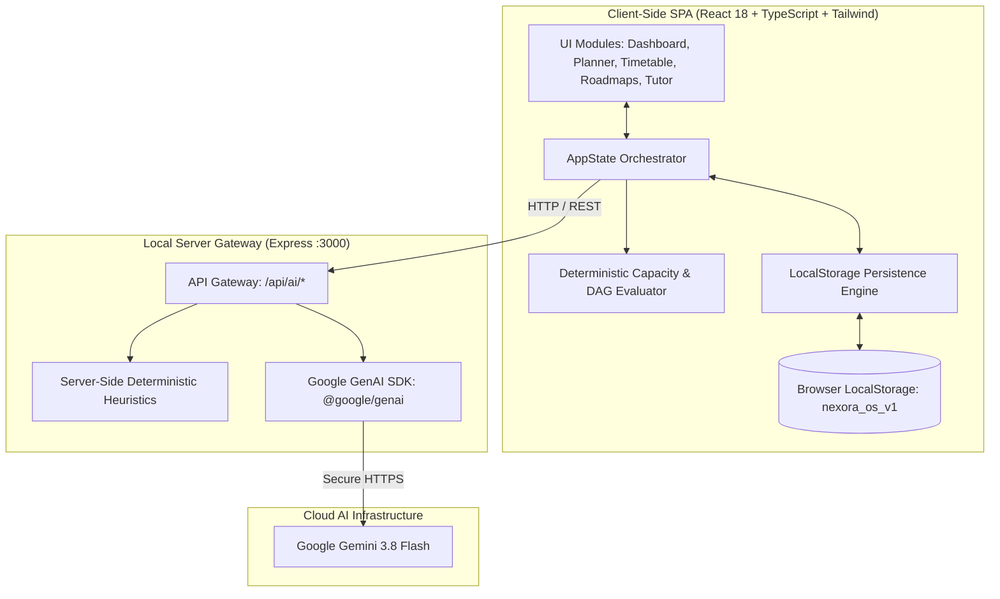

# NEXORA

> **A Local-First Personal Learning & Career Operating System built for the realities of modern college life.**

[](https://www.typescriptlang.org/)
[](https://react.dev/)
[](https://vitejs.dev/)
[](https://tailwindcss.com/)
[](https://ai.google.dev/)
[](#data-sovereignty)

---

## The NEXORA Philosophy

Most student productivity applications treat time as an infinite container, encouraging unrealistic 12-hour study lists that inevitably lead to burnout, missed deadlines, and demoralization.

**NEXORA takes a fundamentally different approach:**

1. **Deterministic Capacity Over Wishful Thinking**: Your day has exactly 1,440 minutes. Before you plan a single task, NEXORA mathematically deducts your sleep (default 8h), fixed commitments (lectures, labs, tutorials, commutes), basic maintenance, and inter-class transition buffers. Study time is capped at a sustainable 75% focus threshold.
2. **Prerequisite Knowledge Graphs (DAGs)**: Learning is not a flat list. NEXORA models course concepts as Directed Acyclic Graphs. You cannot study advanced concepts until foundational prerequisites reach mastery.
3. **Advisory AI with Human-in-the-Loop Diff Staging**: AI never silently overwrites your calendar. Recommendations are staged in interactive diff cards with explicit rationale and priority scores for you to inspect, accept, or reject.
4. **Socratic Mastery Over Passive Summaries**: The integrated AI Tutor challenges your mental models through Socratic questioning, first-principles analogies, and active recall quizzes.
5. **Absolute Data Sovereignty**: All course schedules, syllabus topics, reflection logs, and personal metrics live in your browser's local sandbox with one-click JSON backup export and restore.

---

## Architecture at a Glance



---

## Core System Modules

| Module | Purpose | Key Capabilities |
| :--- | :--- | :--- |
| **Capacity Dashboard** | Daily cognitive budget overview | Displays net available study hours, today's mission progress, upcoming classes, and weekly subject pacing. |
| **Daily Mission Planner** | Capacity-bounded task execution | Time-blocking engine with manual scheduling and AI Advisory Proposals with interactive diff review. |
| **Weekly Timetable** | 7-day recurring schedule | Differentiates fixed lectures/labs/commutes from flexible study windows; auto-calculates transition buffers. |
| **Curriculum Roadmaps** | Prerequisite dependency graphs | Visualizes prerequisite DAGs, locks unready topics, tracks mastery percentages, and generates syllabi via AI. |
| **Socratic AI Tutor** | Academic conceptual coach | 4 modes: Socratic Probing, Step-by-Step Analogies, Active Recall Quizzes, and Prerequisite Breakdowns. |
| **Focus Session Tracker** | Pomodoro & cognitive reflection | Timed study blocks (25m/45m/60m) capturing planned vs. actual minutes, comprehension (1-5★), and energy (1-5). |
| **Progress & Analytics** | Longitudinal academic health | Tracks weekly subject study hours against target credit hours and visualizes curriculum completion rates. |
| **Semester & Subjects** | Academic term configuration | Configures course catalogs, credit units, term dates, and reading weeks / university holidays. |
| **Settings & Sovereignty** | Privacy & engine controls | One-click JSON backup export/restore, capacity threshold sliders, and custom Gemini API key configuration. |

---

## Comprehensive Documentation Index

All system specifications and architectural standards are thoroughly documented in the [`docs/`](./docs) directory:

- [**Product Vision & Strategy** (`docs/PRODUCT.md`)](./docs/PRODUCT.md): Problem space, personas, product pillars, and user journey.
- [**Requirements Specification** (`docs/REQUIREMENTS.md`)](./docs/REQUIREMENTS.md): Functional and non-functional requirements with traceability matrix.
- [**System Architecture** (`docs/ARCHITECTURE.md`)](./docs/ARCHITECTURE.md): Component diagrams, data flows, DAG state machines, and directory boundaries.
- [**Data Architecture & Database** (`docs/DATABASE.md`)](./docs/DATABASE.md): Entity-relationship diagrams (ERD), schemas, and backup protocols.
- [**AI Advisory System** (`docs/AI_SYSTEM.md`)](./docs/AI_SYSTEM.md): AI philosophy, diff inspection patterns, and fallback heuristics.
- [**Learning Engine & Curriculum DAG** (`docs/LEARNING_ENGINE.md`)](./docs/LEARNING_ENGINE.md): Mathematical graph models, status transitions, and mastery boosts.
- [**Planner Engine & Capacity Math** (`docs/PLANNER_ENGINE.md`)](./docs/PLANNER_ENGINE.md): Mathematical formulas for calculating true cognitive study capacity.
- [**Prompt Engineering & Templates** (`docs/PROMPTS.md`)](./docs/PROMPTS.md): Production system instructions, JSON output schemas, and mode prompts.
- [**AI Providers & Configuration** (`docs/PROVIDERS.md`)](./docs/PROVIDERS.md): Model profiles (`gemini-3.8-flash`, `gemini-2.5-pro`), offline modes, and latency/cost analysis.
- [**Security & Threat Model** (`docs/SECURITY.md`)](./docs/SECURITY.md): Threat analysis, API key safety, and zero-telemetry privacy guarantees.
- [**Testing & Verification** (`docs/TESTING.md`)](./docs/TESTING.md): Pure function unit test cases, graph verification, and build scripts.
- [**Product Roadmap** (`docs/ROADMAP.md`)](./docs/ROADMAP.md): Current v0.9.0 capabilities and future milestones (v1.0.0 through v2.0.0).
- [**Changelog** (`docs/CHANGELOG.md`)](./docs/CHANGELOG.md): Version history following the *Keep a Changelog* standard.

---

## Quick Start

### Prerequisites
- Node.js 18+ or 20+
- npm 9+ or bun

### 1. Installation
Clone the repository and install dependencies:
```bash
npm install
```

### 2. Environment Configuration (Optional)
To enable server-side Gemini AI features by default, set your API key in `.env`:
```env
GEMINI_API_KEY=your_gemini_api_key_here
```
*(Note: You can also launch the app without an environment variable and enter your custom Gemini API key directly in **Settings > AI Configuration**, or run completely in **Offline Local Mode** with deterministic heuristics).*

### 3. Start Development Server
```bash
npm run dev
```
The server will boot on `http://localhost:3000`.

### 4. Build for Production
```bash
npm run build
npm run start
```

---

## Verification & Code Quality

Run the TypeScript compiler and linter:
```bash
npm run lint
```

Execute the full production build:
```bash
npm run build
```

---

## License

This project is licensed under the MIT License — see the LICENSE file for details.
