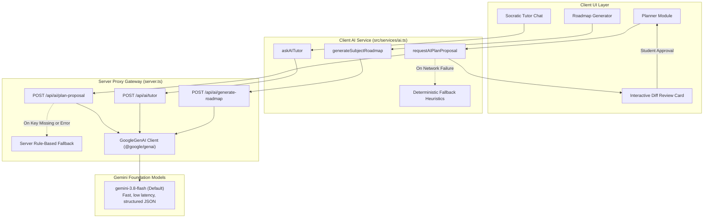
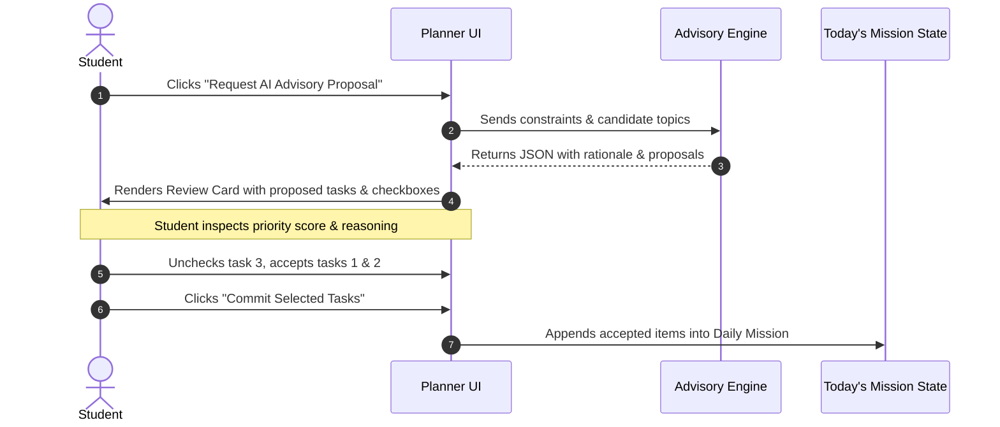

# NEXORA — AI System Specification & Advisory Architecture

## 1. AI Philosophy & Guiding Principles

NEXORA treats Artificial Intelligence not as an autonomous agent that takes over the student's calendar, but as a **specialized academic advisor and cognitive coach**.

### Core Tenets:
1. **Advisory, Never Authoritarian**: AI never writes directly to persistent storage. All AI outputs are returned as structured recommendations staged in a **diff inspection card**.
2. **Context-Grounded**: The AI is fed real mathematical constraints (uncommitted minutes, class schedules, prerequisite readiness, recent energy ratings). It cannot schedule impossible hours.
3. **Socratic Over Superficial**: The AI Tutor encourages active recall, conceptual models, and cognitive retention, refusing to simply provide homework answers or superficial summaries.
4. **Resilient Local Fallback**: If the internet disconnects or no API key is present, the system defaults to deterministic rule-based algorithms without breaking the user experience.

---

## 2. AI Subsystem Architecture

---

## 3. The Three AI Services

### 3.1 Daily Mission Proposal Engine (`/api/ai/plan-proposal`)
Generates a recommended study plan for a target date within strictly bounded time capacity.

- **Inputs Supplied to Model**:
  - Target Date and Day of Week
  - Net Available Study Time (calculated deterministically by `scheduler.ts`)
  - Fixed commitments for the day (classes, labs, commutes)
  - Enrolled subjects and weekly pacing deficits
  - Candidate Topics where prerequisite conditions are met (`prerequisitesMet: true`)
  - Recent study feedback (last 5 sessions' comprehension and energy ratings)
  - Optional student custom Gemini API key and model selection
- **Enforced Constraints**:
  - Total planned study minutes **MUST NOT** exceed 85% of net available minutes.
  - Tasks must have concrete actionable deliverables.
  - Subjects with weekly pacing deficits receive higher priority.
  - Outputs strictly structured JSON with schema validation.

#### Interactive Diff Review Flow:

---

### 3.2 Socratic AI Academic Tutor (`/api/ai/tutor`)
Provides interactive, context-aware conceptual guidance tied to the student's active curriculum.

- **Four Operational Modes**:
  1. **Socratic (`mode: 'socratic'`)**: Asks probing, diagnostic questions to uncover the student's current mental models and assumptions. Refuses to solve problems outright.
  2. **Explain (`mode: 'explain'`)**: Provides intuition-first explanations using vivid analogies, step-by-step physical intuition, and concludes with a comprehension check.
  3. **Quiz (`mode: 'quiz'`)**: Generates challenging conceptual scenarios or edge-case questions to test transfer learning and active recall.
  4. **Breakdown (`mode: 'breakdown'`)**: Decomposes a complex topic into smaller, manageable prerequisite building blocks.
- **Context Injection**: Automatically injects active subject name, topic title, and current mastery level into the system instruction prompt.

---

### 3.3 AI Syllabus & Roadmap Generator (`/api/ai/generate-roadmap`)
Transforms unstructured course descriptions and syllabi into structured, sequential DAG topics.

- **Outputs**:
  - 5 to 7 modular learning topics.
  - Realistic focus study estimates (30 to 90 minutes).
  - Explicit 0-based dependency index references (`prerequisiteIndices: number[]`), ensuring the foundational topics have empty dependencies `[]`.

---

## 4. Fallback Heuristics & Deterministic Safety

When running offline, when no API key is provided, or when the external API errors:

| Scenario | Deterministic Fallback Strategy |
| :--- | :--- |
| **Plan Proposal** | Deterministic planner extracts ready topics (`prerequisitesMet: true`), sorts by lowest mastery level, and budgets 45-minute focus chunks up to 80% of net available capacity. |
| **Socratic Tutor** | Returns a structured First-Principles scaffold prompting the student to isolate definitions, state underlying assumptions, and explain the mechanism step-by-step. |
| **Roadmap Generation** | Generates a standard 4-stage pedagogical progression: *Foundations* $\to$ *Core Mechanisms* $\to$ *Practical Application* $\to$ *Advanced Synthesis*. |

---

## 5. Security & Prompt Integrity

1. **System Prompt Encapsulation**: Strict demarcation between system instructions and untrusted student inputs.
2. **JSON Output Guarantee**: `responseMimeType: "application/json"` ensures model responses cannot break client parser contracts.
3. **No Direct Code Execution**: LLM responses are rendered safely via structured UI cards and sanitized React Markdown components (`react-markdown`).
