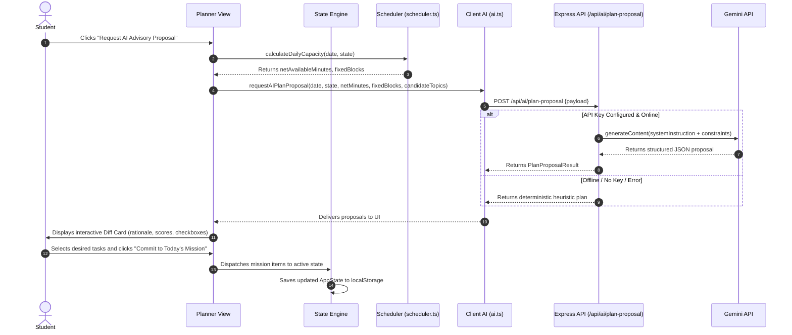
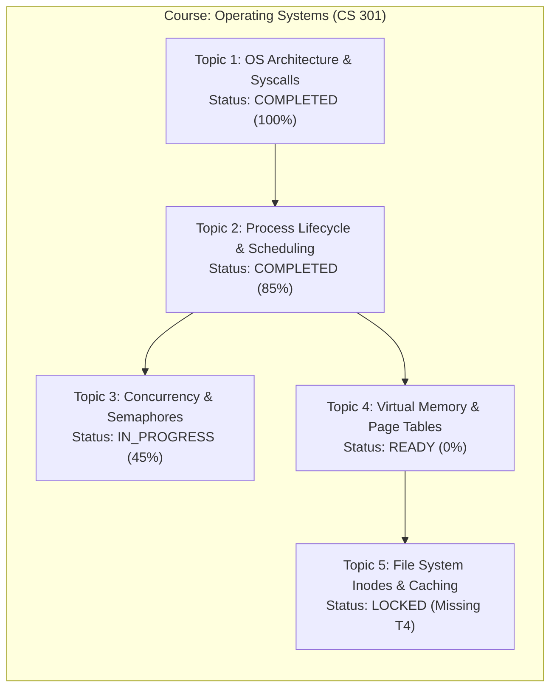

# NEXORA — System Architecture & Design

## 1. High-Level Architecture Overview

NEXORA is built on a **hybrid local-first full-stack architecture**. The system is composed of:

1. **Client-Side Single-Page Application (SPA)**: Written in React 18, TypeScript, and Tailwind CSS. It serves as the primary data orchestrator, holding all state locally and executing deterministic scheduling algorithms directly in the browser.
2. **Local Storage Persistence Layer**: Persists student state to browser `localStorage` under versioned schemas with instant JSON serialization/deserialization.
3. **Node.js / Express Server Proxy**: Acts as a secure, stateless gateway to the Gemini API (`@google/genai`), keeping API keys out of client bundles and enforcing structured JSON schemas.
4. **Vite Development & Static Asset Server**: Serves production-optimized static assets and proxies client API calls during development.

---

## 2. System Component Diagram

```mermaid
graph TB
    subgraph Browser["Client Browser (Local-First Sandbox)"]
        UI[React UI Components<br/>Dashboard, Planner, Timetable, Roadmaps, Tutor]
        State[AppState Orchestrator<br/>App.tsx & React Hooks]
        Scheduler[Deterministic Capacity & DAG Engine<br/>src/services/scheduler.ts]
        AIService[Client AI Service & Offline Fallbacks<br/>src/services/ai.ts]
        Storage[Persistence & Backup Engine<br/>src/services/storage.ts]
        LocalStore[(Browser LocalStorage<br/>nexora_os_v1)]

        UI <--> State
        State --> Scheduler
        State <--> Storage
        Storage <--> LocalStore
        State --> AIService
    end

    subgraph Server["Local Server Layer (Node.js / Express :3000)"]
        ServerEntry[server.ts]
        ProxyEndpoints["API Gateway Routes<br/>/api/ai/plan-proposal<br/>/api/ai/tutor<br/>/api/ai/generate-roadmap"]
        HeuristicFallback[Server-Side Deterministic Heuristics]
        GenAISDK[Google GenAI Client<br/>@google/genai]

        ServerEntry --> ProxyEndpoints
        ProxyEndpoints --> GenAISDK
        ProxyEndpoints --> HeuristicFallback
    end

    subgraph External["External Cloud Infrastructure"]
        GeminiCloud[Google Gemini Models<br/>gemini-3.8-flash / Pro]
    end

    AIService -->|HTTP REST (JSON)| ProxyEndpoints
    GenAISDK -->|Encrypted HTTPS API Calls| GeminiCloud
```

---

## 3. Core Architectural Principles

### 3.1 Local-First Data Sovereignty
- **Client as Authority**: The browser holds the primary canonical copy of the user's data. All reads and mutations occur in memory and synchronously persist to `localStorage`.
- **Zero Mandatory Authentication**: The application operates without sign-up friction or third-party identity providers.
- **Portability**: Complete state can be exported as an unencrypted, human-readable JSON backup (`nexora_backup_YYYY-MM-DD.json`) and restored on any machine.

### 3.2 Deterministic Business Logic vs. Probabilistic AI
- **Strict Separation of Concerns**: Temporal arithmetic, timetable collision detection, prerequisite validation, and study budget caps are strictly calculated using pure deterministic TypeScript functions.
- **AI as Advisory Co-Pilot**: Language models are never permitted to directly write to the database or modify schedules without student consent. All AI proposals are returned as structured candidates and rendered in an interactive diff card.

### 3.3 Secure Server-Side AI Proxy Pattern
To uphold security standards and protect credentials:
- Third-party API keys are never bundled into client-side JavaScript.
- If a user configures their own Gemini key, it is transmitted in the HTTPS request body to the local `/api/ai/*` endpoint, which initializes a short-lived `GoogleGenAI` client for that request.
- If no user key is provided, the server attempts to use the environment-provided `GEMINI_API_KEY`.
- If no key is available or the network fails, both the server and client gracefully downgrade to local deterministic heuristic planners and first-principles scaffolds.

---

## 4. End-to-End Data Flow



---

## 5. Prerequisite DAG Evaluation Architecture

Curriculum topics are evaluated as a Directed Acyclic Graph (DAG) using node-edge dependency mappings:



### DAG State Transition Matrix:
$$\text{Status}(T) = \begin{cases} 
\text{locked} & \text{if } \exists p \in \text{Prerequisites}(T) : \text{Status}(p) \neq \text{completed} \\
\text{ready} & \text{if } \forall p \in \text{Prerequisites}(T) : \text{Status}(p) = \text{completed} \land \text{Mastery}(T) = 0\% \\
\text{in\_progress} & \text{if } \forall p \in \text{Prerequisites}(T) : \text{Status}(p) = \text{completed} \land 0\% < \text{Mastery}(T) < 80\% \\
\text{completed} & \text{if } \text{Mastery}(T) \ge 80\%
\end{cases}$$

---

## 6. Project Directory Structure

```
nexora/
├── docs/                          # Comprehensive system documentation
│   ├── PRODUCT.md                 # Product vision, strategy, personas
│   ├── REQUIREMENTS.md            # Functional & non-functional requirements
│   ├── ARCHITECTURE.md            # System architecture (this document)
│   ├── DATABASE.md                # Schema, entity models, storage lifecycle
│   ├── AI_SYSTEM.md               # AI architecture, advisory workflows
│   ├── LEARNING_ENGINE.md         # Prerequisite DAG & active recall engine
│   ├── PLANNER_ENGINE.md          # Capacity math, timetable logic
│   ├── PROMPTS.md                 # System instructions & prompt templates
│   ├── PROVIDERS.md               # Model providers & offline fallback specs
│   ├── SECURITY.md                # Threat model & key safety architecture
│   ├── TESTING.md                 # Verification, testing & QA strategies
│   ├── ROADMAP.md                 # Current vs planned feature roadmap
│   └── CHANGELOG.md               # Version release history
├── public/                        # Static public assets
├── src/                           # Frontend application source
│   ├── components/                # Modular React UI components
│   │   ├── Dashboard.tsx          # Capacity metrics & daily overview
│   │   ├── DailyPlannerModule.tsx # Time-blocking & AI proposal workflow
│   │   ├── TimetableModule.tsx    # 7-day recurring commitments schedule
│   │   ├── RoadmapModule.tsx      # Curriculum topic DAG visualizer
│   │   ├── AITutorModule.tsx      # Socratic coaching & quiz chat interface
│   │   ├── ProgressModule.tsx     # Academic analytics & subject pacing
│   │   ├── SemesterModule.tsx     # Term dates, courses, and holiday setup
│   │   ├── SettingsModule.tsx     # Data backup, capacity limits, AI config
│   │   ├── SessionTrackerModal.tsx# Pomodoro timer, energy & reflection modal
│   │   └── OnboardingModal.tsx    # First-time user onboarding setup wizard
│   ├── services/                  # Core deterministic & AI services
│   │   ├── scheduler.ts           # Capacity math, timetable logic, DAG evaluator
│   │   ├── ai.ts                  # Client AI bridge & heuristic fallback
│   │   └── storage.ts             # LocalStorage engine, demo state, backup
│   ├── types.ts                   # Core TypeScript domain models & schemas
│   ├── App.tsx                    # Top-level state orchestrator & navigation
│   ├── main.tsx                   # React root mount
│   └── index.css                  # Global Tailwind CSS imports
├── index.html                     # HTML entry point with metadata tags
├── server.ts                      # Express API gateway & Vite dev middleware
├── metadata.json                  # Application metadata & permissions
├── package.json                   # Dependencies & npm scripts
├── tsconfig.json                  # TypeScript compiler configuration
└── vite.config.ts                 # Vite build & plugin configuration
```
