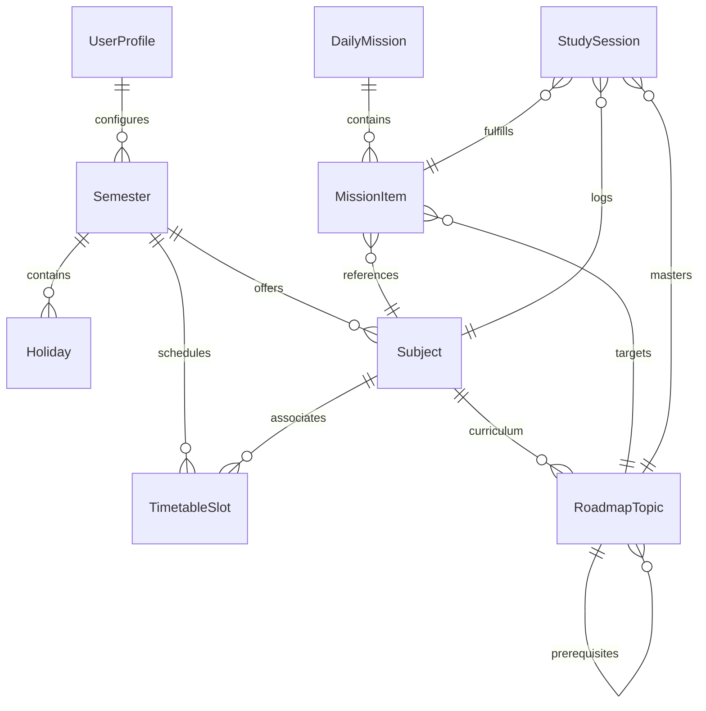
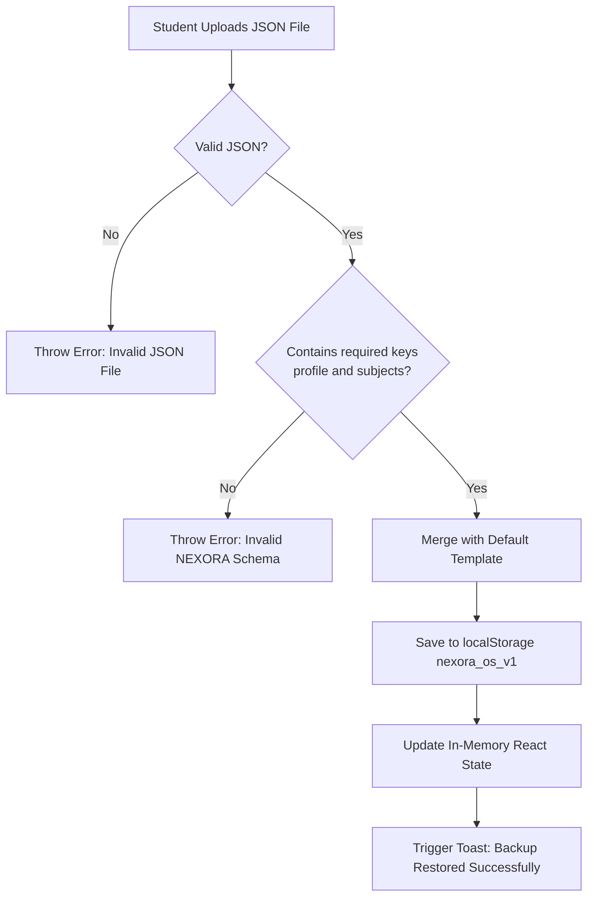

# NEXORA — Data Architecture & Storage Specification

## 1. Storage Architecture Overview

NEXORA employs an **offline-first document store** modeled around browser `localStorage`. This guarantees:
- Zero cloud latency for CRUD operations.
- Immediate operational availability without internet connectivity.
- Absolute data ownership by the student.

The entire system state is encapsulated in a single, strongly-typed JSON root document stored under the storage key:
```typescript
const STORAGE_KEY = 'nexora_os_v1';
```

---

## 2. Entity-Relationship Diagram (ERD)



---

## 3. Data Entities & Schema Definitions

### 3.1 UserProfile (`profile`)
Stores student configuration, capacity thresholds, and AI provider settings.

| Field | Type | Description | Default / Example |
| :--- | :--- | :--- | :--- |
| `name` | `string` | Student's display name | `"Alex Mercer"` |
| `university` | `string` | Academic institution | `"State Polytechnic University"` |
| `degreeMajor` | `string` | Degree program & specialization | `"Computer Science & Software Engineering"` |
| `currentYear` | `string` | Academic standing | `"Year 3 (Junior)"` |
| `dailyCapacityMaxHours` | `number` | Hard daily study cap ceiling (hours) | `4.5` |
| `defaultBufferMinutes` | `number` | Transition buffer between fixed blocks (minutes) | `15` |
| `sleepHours` | `number` | Protected daily sleep budget (hours) | `8` |
| `aiProvider` | `'gemini' \| 'custom' \| 'offline'` | Active AI engine mode | `'gemini'` |
| `apiKey` | `string?` | Optional student-provided Gemini API key | `undefined` |
| `customEndpoint` | `string?` | Optional custom inference proxy endpoint | `undefined` |
| `aiModel` | `string?` | Preferred Gemini model variant | `'gemini-3.8-flash'` |
| `hasCompletedOnboarding` | `boolean` | Flag for first-run onboarding status | `true` |

---

### 3.2 Semester & Holidays (`semesters`, `holidays`)
Defines the boundary of an academic term and non-instructional break periods.

```typescript
export interface Holiday {
  id: string;             // Unique ID e.g. "h-1"
  name: string;           // Display title e.g. "Reading Week"
  startDate: string;      // YYYY-MM-DD
  endDate: string;        // YYYY-MM-DD
  type: 'holiday' | 'break' | 'exam_prep';
}

export interface Semester {
  id: string;             // e.g. "sem-fall-2026"
  name: string;           // "Fall 2026 (Semester 5)"
  startDate: string;      // YYYY-MM-DD
  endDate: string;        // YYYY-MM-DD
  holidays: Holiday[];    // Array of break periods
  targetWeeklyStudyHours: number; // e.g. 18 hours
  isActive: boolean;      // Active term selector
}
```

---

### 3.3 Academic Subject (`subjects`)
Represents an enrolled course with weekly study pacing targets.

```typescript
export interface Subject {
  id: string;             // Unique identifier e.g. "sub-os"
  semesterId: string;     // Parent semester reference
  code: string;           // Course catalog code e.g. "CS 301"
  name: string;           // Full course name e.g. "Operating Systems"
  color: string;          // Hex color or Tailwind token e.g. "#3B82F6"
  targetWeeklyHours: number; // Weekly study goal in hours (e.g. 6)
  credits: number;        // Course credit weight (e.g. 4)
  syllabusOverview?: string; // High-level course context for AI tools
}
```

---

### 3.4 Timetable Slot (`timetable`)
Represents recurring weekly commitments (Monday–Sunday).

```typescript
export type DayOfWeek = 'monday' | 'tuesday' | 'wednesday' | 'thursday' | 'friday' | 'saturday' | 'sunday';
export type SlotType = 'lecture' | 'lab' | 'tutorial' | 'commute' | 'personal' | 'study_window';

export interface TimetableSlot {
  id: string;             // e.g. "tt-1"
  semesterId: string;     // Enclosing semester
  subjectId?: string;     // Optional link to course (e.g. "sub-os")
  title: string;          // e.g. "CS 301: OS Lecture"
  dayOfWeek: DayOfWeek;   // Weekly recurrence
  startTime: string;      // 24-hour "HH:mm" (e.g. "09:00")
  endTime: string;        // 24-hour "HH:mm" (e.g. "10:30")
  location?: string;      // Physical room or link (e.g. "Hall 104")
  isFixed: boolean;       // true = non-negotiable commit; false = study window
  type: SlotType;         // Slot taxonomy
}
```

---

### 3.5 Curriculum Roadmap Topic (`topics`)
Node in the prerequisite Directed Acyclic Graph (DAG).

```typescript
export type TopicStatus = 'locked' | 'ready' | 'in_progress' | 'completed';

export interface RoadmapTopic {
  id: string;                  // e.g. "top-os-1"
  subjectId: string;           // Parent subject
  title: string;               // e.g. "Process Synchronization"
  description: string;         // Conceptual scope
  estimatedMinutes: number;    // Recommended single-session duration
  prerequisiteTopicIds: string[]; // Parent DAG node IDs
  status: TopicStatus;         // Computed or assigned state
  masteryLevel: number;        // 0 to 100 percentage
  notes?: string;              // Student summary notes
  orderIndex: number;          // Visual sequence ordering
  lastStudiedAt?: string;      // ISO timestamp of last logged session
}
```

---

### 3.6 Daily Mission & Items (`missions`)
Daily execution checklist keyed by date string (`YYYY-MM-DD`).

```typescript
export type MissionItemStatus = 'pending' | 'in_progress' | 'completed' | 'skipped';

export interface MissionItem {
  id: string;                  // e.g. "mi-101"
  topicId?: string;            // Link to curriculum topic
  subjectId?: string;          // Link to enrolled subject
  title: string;               // Concrete action item
  plannedMinutes: number;      // Budgeted study minutes
  actualMinutes: number;       // Elapsed study minutes
  status: MissionItemStatus;   // Current task status
  scheduledTime?: string;      // Optional planned start (e.g. "14:00")
  isAIRecorded: boolean;       // True if proposed by advisory engine
  priorityScore?: number;      // AI priority ranking (0 - 100)
  reason?: string;             // Advisory rationale
}

export interface DailyMission {
  id: string;                  // e.g. "mission-2026-09-21"
  date: string;                // "YYYY-MM-DD"
  availableMinutes: number;    // Net calculated capacity
  allocatedMinutes: number;    // Sum of planned item minutes
  items: MissionItem[];        // Ordered daily tasks
  reflectionNotes?: string;    // End-of-day journal reflection
  aiProposalRationale?: string;// Rationale from advisory AI
}
```

---

### 3.7 Study Session (`sessions`)
Historical log record of focused study work and cognitive reflection.

```typescript
export interface StudySession {
  id: string;                  // e.g. "sess-1726912345678"
  missionItemId?: string;      // Optional mission item origin
  topicId?: string;            // Curriculum topic studied
  subjectId: string;           // Enclosing subject
  startTime: string;           // ISO timestamp
  endTime?: string;            // ISO timestamp
  plannedDurationMinutes: number; // Planned duration
  actualDurationMinutes: number;  // Actual duration
  comprehensionRating: 1 | 2 | 3 | 4 | 5; // 1 = Lost, 5 = Mastered
  energyRating: 1 | 2 | 3 | 4 | 5;        // 1 = Exhausted, 5 = Peak Flow
  keyTakeaways: string;        // Qualitative takeaway
  date: string;                // YYYY-MM-DD
}
```

---

## 4. Storage Lifecycle & Backup Specification

### 4.1 Export Format (`exportStateAsJSON`)
- Downloads a formatted `.json` file containing the full `AppState` object:
```json
{
  "profile": { ... },
  "activeSemesterId": "sem-fall-2026",
  "semesters": [ ... ],
  "subjects": [ ... ],
  "timetable": [ ... ],
  "topics": [ ... ],
  "missions": { ... },
  "sessions": [ ... ]
}
```
- Filename pattern: `nexora_backup_YYYY-MM-DD.json`.

### 4.2 Import & Validation Routine (`importStateFromJSON`)


### 4.3 Storage Capacity Analysis
- Typical browser `localStorage` quota: **5.0 MB – 10.0 MB**.
- Average NEXORA record sizes:
  - 1 Semester + 5 Subjects + 40 Timetable slots: **~6 KB**
  - 40 Topics with notes: **~18 KB**
  - 180 Days of Daily Missions: **~45 KB**
  - 500 Completed Study Sessions with reflections: **~120 KB**
- Total estimated footprint for an entire academic year: **~190 KB (< 4% of quota)**.
