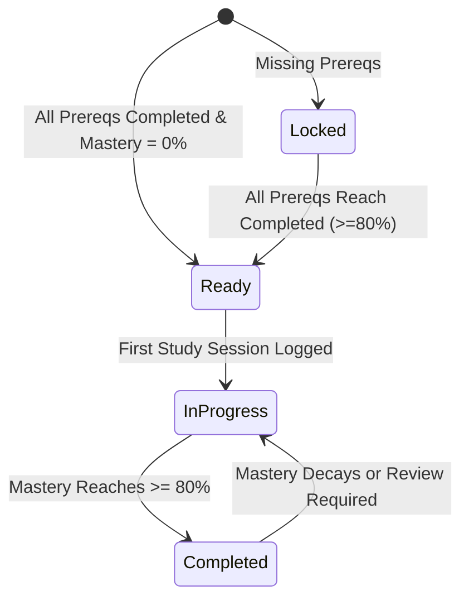
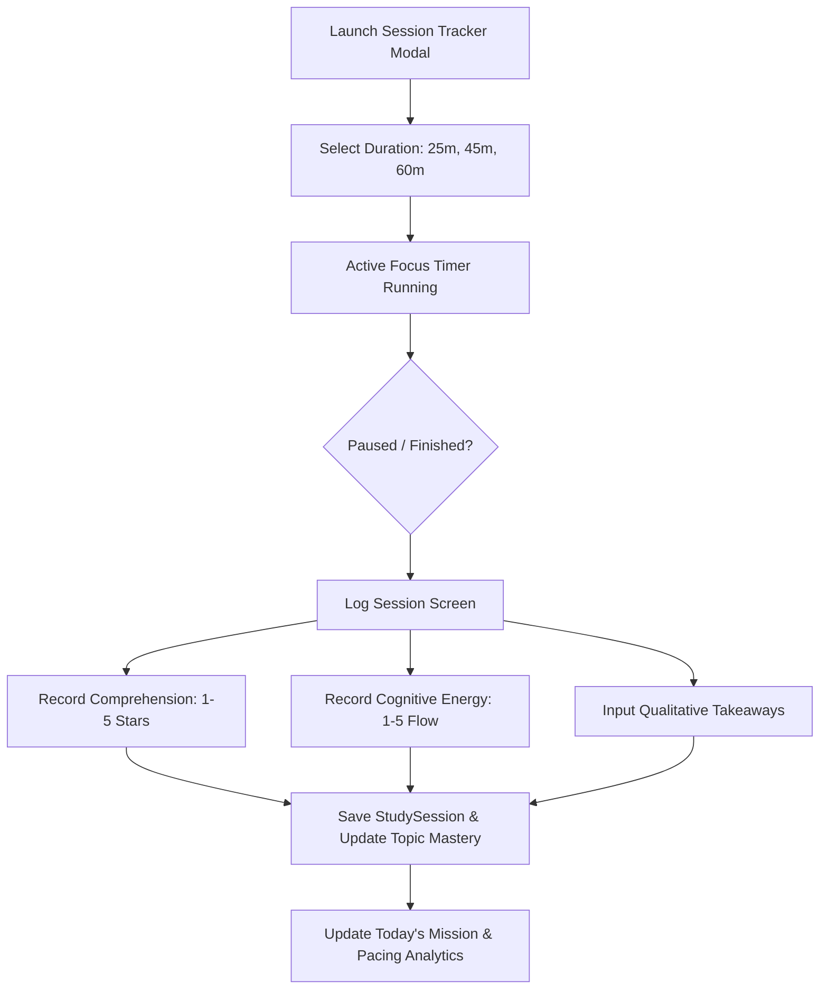

# NEXORA — Learning Engine & Curriculum DAG Specification

## 1. Pedagogical Philosophy

Traditional educational tools fail because they assume students can jump arbitrarily into complex coursework without prerequisite mastery. NEXORA’s learning engine is built on three core pedagogical principles:

1. **Cognitive Load Theory (Sweller)**: Working memory is strictly limited. Attempting to master high-level concepts without fluent foundational schemas causes cognitive overload and rapid fatigue.
2. **Knowledge Structures as Directed Acyclic Graphs (DAGs)**: Academic concepts are not flat linear lists; they are hierarchical dependency networks.
3. **Active Reflection & Metacognition**: Retention requires deliberate reflection post-study—evaluating subjective comprehension, energy expenditure, and key mental models.

---

## 2. Prerequisite DAG Mathematical Specification

Let a subject curriculum be represented as a finite directed acyclic graph:
$$G = (V, E)$$
Where:
- $V = \{t_1, t_2, \dots, t_n\}$ is the set of all curriculum topics.
- $E \subseteq V \times V$ is the set of directed edges where $(u, v) \in E$ denotes that topic $u$ is an immediate prerequisite of topic $v$ ($u \to v$).

### 2.1 Graph Node Properties
Each topic $t \in V$ contains:
$$\text{Topic}(t) = \langle \text{id}, \text{subjectId}, \text{title}, \text{masteryLevel}, \text{status}, \text{prerequisiteTopicIds} \rangle$$
Where:
- $\text{masteryLevel} \in [0, 100]$
- $\text{status} \in \{\text{locked}, \text{ready}, \text{in\_progress}, \text{completed}\}$
- $\text{prerequisiteTopicIds} = \{u \in V \mid (u, t) \in E\}$

---

## 3. Dynamic Topic Status State Machine



### 3.1 Evaluation Algorithm (`evaluatePrerequisites`)
For any given topic $t \in V$:
```typescript
function evaluatePrerequisites(
  topic: RoadmapTopic,
  allTopics: RoadmapTopic[]
): { prerequisitesMet: boolean; missingPrereqs: RoadmapTopic[] } {
  if (!topic.prerequisiteTopicIds || topic.prerequisiteTopicIds.length === 0) {
    return { prerequisitesMet: true, missingPrereqs: [] };
  }

  const topicMap = new Map(allTopics.map((t) => [t.id, t]));
  const missingPrereqs: RoadmapTopic[] = [];

  for (const prereqId of topic.prerequisiteTopicIds) {
    const prereq = topicMap.get(prereqId);
    if (!prereq || prereq.status !== 'completed') {
      if (prereq) missingPrereqs.push(prereq);
    }
  }

  return {
    prerequisitesMet: missingPrereqs.length === 0,
    missingPrereqs,
  };
}
```

---

## 4. Mastery Level Progression Mathematics

When a student completes a focus study session targeting topic $t$, the system updates the topic's mastery level dynamically:

$$\Delta \text{Mastery} = \text{comprehensionRating} \times 5$$

Where $\text{comprehensionRating} \in \{1, 2, 3, 4, 5\}$:
- **Rating 1 (Lost / Confused)**: $\Delta M = +5\%$
- **Rating 2 (Shaky Fundamentals)**: $\Delta M = +10\%$
- **Rating 3 (Solid Grasp)**: $\Delta M = +15\%$
- **Rating 4 (Fluent Application)**: $\Delta M = +20\%$
- **Rating 5 (Mastered / Can Teach It)**: $\Delta M = +25\%$

The updated mastery level is bounded by $[0, 100]$:
$$M_{\text{new}} = \min(100, M_{\text{current}} + \Delta \text{Mastery})$$

If $M_{\text{new}} \ge 80\%$, the topic transitions to `completed`, automatically triggering prerequisite unlock evaluation across all downstream dependent child topics in the DAG.

---

## 5. Focus Session & Cognitive Reflection Engine



### Session Reflection Telemetry Schema:
- `actualDurationMinutes`: Measured elapsed time in focus.
- `comprehensionRating` (1 to 5): Subjective assessment of conceptual understanding.
- `energyRating` (1 to 5):
  - **1**: Exhausted / Depleted
  - **2**: Fatigued / Low concentration
  - **3**: Stable / Normal baseline
  - **4**: Energized / Focused
  - **5**: Peak Flow / Effortless focus
- `keyTakeaways`: Qualitative notes reinforcing active recall.

---

## 6. Planned Spaced Repetition (FSRS / SM-2) Specifications (v1.1)

In future releases, mastery will incorporate temporal decay using the Free Spaced Repetition Scheduler (FSRS) algorithm:
$$R(t, S) = \left(1 + \text{factor} \cdot \frac{t}{S}\right)^{-1}$$
Where $R$ is retrievability, $t$ is days elapsed since last session, and $S$ is memory stability. Topics will automatically flag for review when $R < 0.85$, feeding directly into the Daily Mission candidate pool.
