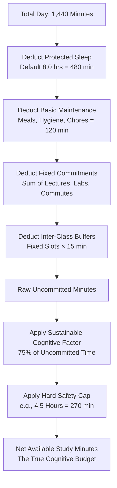
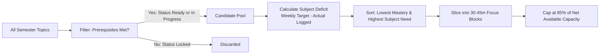

# NEXORA — Planner Engine & Capacity Specification

## 1. The Real-Capacity Philosophy

Most productivity apps fail students by enabling **wishful planning**: allowing users to schedule 12 hours of deep work on a day packed with classes, labs, and commuting. 

NEXORA’s Planner Engine enforces **mathematical realism**. Before any task is added, the engine derives the student's *actual uncommitted time* and bounds it with a *sustainable cognitive coefficient*.

---

## 2. Capacity Derivation Pipeline

---

## 3. Mathematical Formulae

Let $T_{\text{day}} = 1440$ minutes.

### 3.1 Fixed Deductions
1. **Sleep Budget**:
   $$T_{\text{sleep}} = \text{profile.sleepHours} \times 60 \quad (\text{default: } 480\text{ min})$$

2. **Basic Maintenance Baseline**:
   $$T_{\text{maintenance}} = 120\text{ min}$$

3. **Fixed Timetable Slots**:
   $$T_{\text{fixed}} = \sum_{s \in \text{Slots}_{\text{fixed}}} (\text{timeToMinutes}(s.\text{endTime}) - \text{timeToMinutes}(s.\text{startTime}))$$

4. **Inter-Slot Transition Buffers**:
   $$T_{\text{buffer}} = |\text{Slots}_{\text{fixed}}| \times \text{profile.defaultBufferMinutes} \quad (\text{default: } 15\text{ min/slot})$$

### 3.2 Raw Free Time
$$T_{\text{uncommitted}} = \max(0, T_{\text{day}} - T_{\text{sleep}} - T_{\text{maintenance}} - T_{\text{fixed}} - T_{\text{buffer}})$$

*Holiday / Break Modifier*: If the target date falls within a configured semester holiday or reading week:
$$T_{\text{uncommitted}} = \max(T_{\text{uncommitted}}, 360\text{ min})$$

### 3.3 Sustainable Study Capacity
To prevent burnout, the engine bounds daily study to 75% of raw uncommitted time:
$$T_{\text{sustainable}} = \lfloor T_{\text{uncommitted}} \times 0.75 \rfloor$$

### 3.4 Hard Capacity Ceiling
The net available study minutes for the day is capped by the student's personal safety threshold:
$$T_{\text{net}} = \max(30, \min(T_{\text{sustainable}}, \text{profile.dailyCapacityMaxHours} \times 60))$$

---

## 4. Timetable Representation & Slot Mechanics

### 4.1 Time Representation
All times in the timetable are stored in 24-hour ISO format (`HH:mm`), converted internally to minutes since midnight ($0 \dots 1439$):
$$\text{timeToMinutes}(H, M) = H \times 60 + M$$

### 4.2 Slot Taxonomy
- **`lecture`**: Fixed instructor-led classroom course.
- **`lab`**: Fixed laboratory session (typically high cognitive/physical presence).
- **`tutorial`**: Fixed recitation or problem-solving section.
- **`commute`**: Fixed transit time to/from campus.
- **`personal`**: Fixed doctor appointments, meals, or scheduled sports.
- **`study_window`**: Flexible placeholder block representing prime self-study opportunities.

---

## 5. Candidate Ranking & Task Scheduling Pipeline

When generating daily missions (either via heuristic fallback or advisory AI), candidate topics are filtered and prioritized using the following ranking pipeline:

### Ranking Score Formula:
$$\text{PriorityScore}(t) = 0.4 \times (100 - \text{Mastery}(t)) + 0.4 \times \text{SubjectNeed}(s) + 0.2 \times \text{RecencyFactor}(t)$$

Where:
- $\text{Mastery}(t) \in [0, 100]$: Lower mastery yields higher study priority.
- $\text{SubjectNeed}(s) = \max(0, \text{TargetWeeklyHours} - \text{CurrentWeeklyHours})$: Prioritizes subjects lagging behind weekly goals.
- $\text{RecencyFactor}(t)$: Bumps topics not studied within the last 5 days.

---

## 6. Daily Mission Execution Flow

1. **Morning / Prior Evening Planning**:
   - Engine calculates $T_{\text{net}}$ from schedule.
   - User reviews available time and clicks *Request AI Advisory Proposal* or adds tasks manually.
2. **Review & Diff Staging**:
   - Proposed items are presented with rationale, proposed minutes, and priority scores.
   - User selects items; selected items are committed to `DailyMission.items`.
3. **Execution & Pacing Tracking**:
   - Tasks are launched directly into the *Focus Session Tracker*.
   - Actual minutes are tallied in real time.
   - Completion bar monitors $\frac{\text{Allocated Minutes}}{T_{\text{net}}}$, warning the student if they attempt to overcommit beyond their calculated safe capacity.
