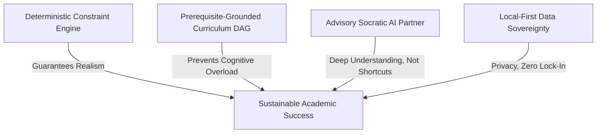
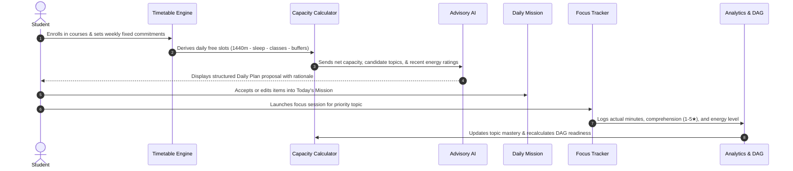

# NEXORA — Product Vision & Strategy

## Executive Summary

**NEXORA** is a local-first Personal Learning & Career Operating System built specifically for the realities of modern higher education. Unlike traditional task managers that treat student time as an infinite bucket, or generic AI tools that hallucinate ungrounded schedules, NEXORA operates on a **capacity-aware deterministic core** paired with an **advisory AI partner**.

NEXORA protects student cognitive health and prevents academic burnout by enforcing strict physical and temporal constraints—accounting for sleep, lecture schedules, lab blocks, transit buffers, and mental energy limits.

---

## The Problem Space

College students face three interrelated failures in existing productivity tools:

1. **The "Infinite To-Do List" Illusion**: Conventional productivity apps (Notion, Todoist, Trello) allow unbounded task accretion. Students plan 10 hours of intense study on a day with 6 hours of lectures and 2 hours of commute, leading to chronic task slippage, demoralization, and sleep deprivation.
2. **Context-Free AI Assistants**: Standard LLM chat interfaces lack awareness of academic prerequisites, syllabus sequences, active mastery levels, or fixed timetable constraints. They give generic advice rather than curriculum-grounded guidance.
3. **Cloud Lock-In & Privacy Intrusion**: Students' academic records, daily schedules, cognitive reflections, and personal struggles are routinely extracted into centralized advertising or proprietary telemetry ecosystems.

---

## Core Product Pillars

### 1. Deterministic Capacity Engine
The application—not an LLM—is the ultimate authority on time, availability, and scheduling logic. A student's day consists of exactly 1,440 minutes. Study capacity is mathematically derived after subtracting sleep (e.g., 8 hours), fixed commitments (classes, labs, tutorials), meals, and inter-class transit buffers. Study recommendations are capped at a sustainable fraction (75% of net free time, subject to a user-configured safety ceiling).

### 2. Prerequisite DAG (Directed Acyclic Graph)
Learning is inherently hierarchical. NEXORA models subjects as dependency graphs. Topics with unfulfilled prerequisites are locked, preventing students from jumping into advanced materials (e.g., Virtual Memory) before mastering foundational prerequisites (e.g., Address Spaces and CPU Architecture).

### 3. Advisory AI with Human-in-the-Loop Diff Staging
NEXORA utilizes AI strictly as an **advisory co-pilot**, never an autonomous scheduler:
- The AI proposes daily study plans based on urgency, mastery deficits, and timetable gaps.
- Proposals are staged in a **structured review card** showing priority scores, time allocations, and rationale.
- The student maintains complete agency, accepting, selectively picking, modifying, or rejecting recommendations with one click.

### 4. Socratic Mastery Over Passive Summarization
The integrated AI Tutor prioritizes active recall, Socratic questioning, and first-principles mental models over passive answers. It encourages deep comprehension rather than superficial copy-pasting.

### 5. Local-First Sovereignty
All student data (semesters, course catalogs, timetables, study session logs, comprehension scores) lives inside the user's browser sandbox via client storage, with instant JSON export and backup capabilities.

---

## User Personas

| Persona | Academic Profile | Core Pain Point | How NEXORA Solves It |
| :--- | :--- | :--- | :--- |
| **STEM Undergraduate** | CS / Engineering (Year 2–4) | Dense schedules, rigorous prerequisite dependencies, labs + projects. | Enforces prerequisite sequencing; schedules realistic 45–60 min deep-work blocks around heavy lab days. |
| **Pre-Med / Life Sciences** | Biology / Chemistry (Year 1–3) | Immense memorization volume, clinical volunteering, burnout vulnerability. | Active recall focus modes; daily capacity limiter prevents 14-hour unsustainable crunch days. |
| **Double Major / Honors** | Multi-disciplinary course loads | Fragmented timetable, competing assignment deadlines across faculties. | Visual weekly timetable balances weekly credit-hour targets evenly across disparate subjects. |

---

## Product Interaction Loop

---

## Current vs. Planned Feature Scope

### Current Functionality (v0.9.0)
- **Capacity-Aware Dashboard**: Dynamic calculation of daily cognitive budget, next campus class, and today's study checklist.
- **7-Day Weekly Timetable**: Fixed class/lab/commute slots vs. flexible open study windows, with automatic transition buffers.
- **Daily Mission Planner**: Time-blocking engine with manual and AI-assisted task scheduling.
- **Prerequisite Curriculum Roadmaps**: Visual Directed Acyclic Graph dependencies, locking mechanisms, and mastery percentages.
- **AI Syllabus Generator**: Decomposes course descriptions into prerequisite-linked learning topics.
- **Socratic AI Tutor**: 4 modes (Socratic Questioning, Step-by-Step Analogies, Concept Quizzes, Prerequisite Breakdown).
- **Focus Session Tracker**: Integrated timer with post-session reflection, comprehension ratings, and cognitive energy tracking.
- **Academic Progress & Analytics**: Weekly target vs. actual hours per subject, curriculum completion metrics, session history.
- **Semester & Holiday Management**: Custom term start/end dates, mid-semester reading weeks, and holiday breaks.
- **Local-First Data Sovereignty**: Full localStorage persistence, zero mandatory login, JSON export/import, and custom Gemini API key configuration.

### Planned Functionality (v1.0.0+)
- **Spaced Repetition Review Schedule**: Integration of modern spaced repetition algorithms (FSRS / SM-2) directly into daily mission candidate generation.
- **Calendar Synchronization**: Bidirectional or read-only `.ics` iCalendar subscription feed integration (Google Calendar, Outlook, Canvas LMS).
- **Syllabus PDF & Document Ingestion**: Client-side document parsing to extract assignment due dates and reading lists automatically.
- **Career & Internship Milestone Roadmaps**: Linking academic coursework to technical interview preparation, project portfolios, and internship recruiting timelines.
- **End-to-End Encrypted Cloud Backup**: Optional peer-to-peer or private cloud synchronization across desktop and mobile devices.
