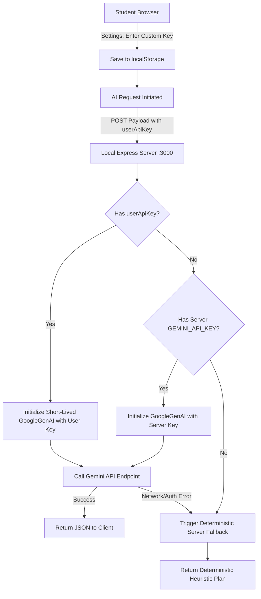

# NEXORA — AI Providers & Inference Configuration

## 1. Provider Ecosystem Overview

NEXORA’s AI architecture is designed around **provider agnosticism** and **local resilience**. The system supports three operating modes:

1. **Google Gemini (Default)**: Leverages Google’s state-of-the-art multimodal foundation models via the official `@google/genai` TypeScript SDK.
2. **Local-First Offline Engine**: Complete in-browser deterministic heuristic engine requiring zero internet connectivity or API credentials.
3. **Custom Proxy / Self-Hosted (Planned)**: Extensible bridge for students who run local inference engines (Ollama, vLLM, LocalAI) or enterprise endpoints.

---

## 2. Supported Model Profiles

| Model Identifier | Provider | Latency | Context Window | Best Suited For |
| :--- | :--- | :--- | :--- | :--- |
| **`gemini-3.8-flash`** *(Default)* | Google | ~350–700 ms | 1,000,000 tokens | Real-time daily plan proposals, interactive Socratic tutoring, rapid syllabus breakdown. High JSON fidelity. |
| **`gemini-2.5-pro`** *(Optional)* | Google | ~1.2–2.5 s | 2,000,000 tokens | Deep mathematical theorem breakdown, exhaustive multi-page course syllabus ingestion, complex reasoning. |
| **`offline-heuristic`** | In-Browser Engine | < 5 ms | N/A | High-privacy environments, flight/transit study, zero network availability. |

---

## 3. Client Key Management & Proxy Routing

### Key Safety Guarantees:
- Student-entered API keys are **never hard-coded** into static JavaScript bundles.
- Keys are transmitted exclusively via local HTTPS/HTTP to the local server proxy.
- The server does not write student keys to any persistent database or system log files.

---

## 4. Operational Degradation Matrix

| Operating Condition | Plan Proposal Engine | Socratic Tutor Chat | Syllabus Generator |
| :--- | :--- | :--- | :--- |
| **Full Connectivity + Valid Key** | Live Gemini flash generation; context-aware ranking; priority scores. | Interactive conversational Socratic dialogue; diagnostic probing. | Full course syllabus decomposition into 5–7 prerequisite-linked DAG nodes. |
| **Server Key Active (No User Key)** | Seamless default execution utilizing server deployment credentials. | Live Socratic tutor responses. | Full syllabus breakdown. |
| **Offline / Network Interruption** | Instant deterministic scheduler allocates 80% safe budget sorted by lowest mastery. | First-principles diagnostic scaffold cards prompting active self-explanation. | Pedagogical 4-stage topic scaffold (*Foundations* $\to$ *Mechanisms* $\to$ *Application* $\to$ *Synthesis*). |
| **Invalid / Exhausted API Key** | Auto-catches error, logs console warning, seamlessly executes deterministic fallback without crashing UI. | Displays clear notice in chat card suggesting API key verification. | Returns default topic scaffolding with status toast. |

---

## 5. Token Usage & Cost Estimates

Because NEXORA sends compact structured JSON payloads, token consumption is minimal:

| AI Action | Typical Input Tokens | Typical Output Tokens | Est. Cost per Call (`gemini-3.8-flash`) |
| :--- | :--- | :--- | :--- |
| **Daily Plan Proposal** | ~1,200 tokens | ~350 tokens | < $0.0002 |
| **Socratic Tutor Turn** | ~600 tokens | ~250 tokens | < $0.0001 |
| **Syllabus Generation** | ~800 tokens | ~500 tokens | < $0.0002 |

*Average monthly cost for an intensive student making 10 planning requests and 50 tutor queries per week is less than $0.05 USD.*
