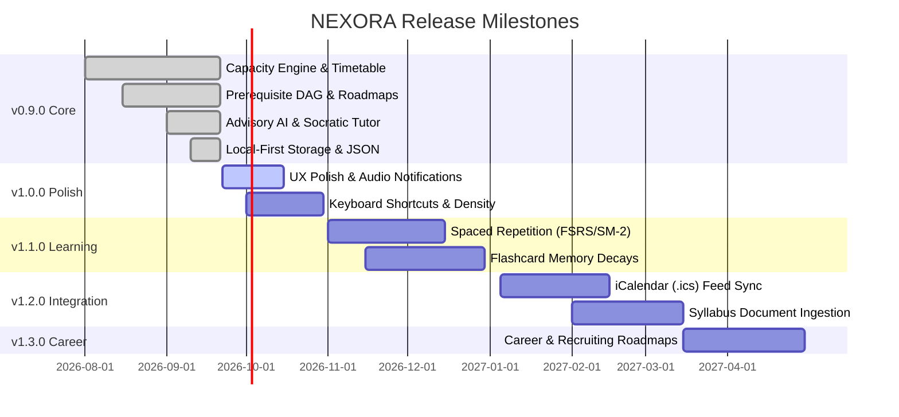

# NEXORA — Product Roadmap & Milestones

## 1. Roadmap Timeline Overview

---

## 2. Detailed Milestone Specifications

### Milestone 1: v0.9.0 — The Deterministic Core (Current)
*Status: Complete & Operational*

- [x] **Capacity Engine**: Calculates true daily free study budget from $1440 - \text{sleep} - \text{classes} - \text{buffers}$.
- [x] **7-Day Timetable**: Fixed class/lab/commute slots vs. flexible study windows.
- [x] **Curriculum DAG**: Directed Acyclic Graph topics with prerequisite status evaluation and mastery percentages.
- [x] **Daily Mission Planner**: Time-blocking checklist with manual and advisory AI planning.
- [x] **Human-in-the-Loop AI Diff Staging**: Staged proposals with rationale, priority scores, and individual task acceptance.
- [x] **Socratic AI Tutor**: 4 modes (`socratic`, `explain`, `quiz`, `breakdown`) grounded in active coursework.
- [x] **AI Syllabus Generator**: Decomposes course descriptions into prerequisite-linked DAG topics.
- [x] **Focus Session Tracker**: Pomodoro timer with post-session reflection, comprehension ratings (1–5★), and cognitive energy tracking (1–5).
- [x] **Academic Analytics**: Weekly target vs. actual hours per subject and curriculum completion metrics.
- [x] **Local-First Data Sovereignty**: Versioned localStorage (`nexora_os_v1`), JSON export/import, and custom Gemini API key configuration.

---

### Milestone 2: v1.0.0 — Production Polish & Keyboard Mastery (Planned)
*Target: Q4 2026*

- [ ] **Ambient Audio & Pomodoro Chimes**: Optional gentle completion sounds for focus/break intervals using Web Audio API.
- [ ] **Global Keyboard Shortcuts**: Quick navigation (`Cmd/Ctrl + 1..8`), focus session start/stop (`Space`), and new task shortcut (`N`).
- [ ] **Rich Markdown Topic Notes**: Full rich-text notes editor inside topic inspection drawer.
- [ ] **Dark / Light Theme Preferences**: User-configurable high-contrast dark mode tailored for late-night college study.

---

### Milestone 3: v1.1.0 — Spaced Repetition & Memory Retention (Planned)
*Target: Q4 2026 – Q1 2027*

- [ ] **FSRS / SM-2 Algorithmic Scheduling**: Mathematical modeling of memory retrievability and stability over time.
- [ ] **Topic Memory Decay Visualizer**: Color-coded topic mastery degradation indicating concepts due for review.
- [ ] **Automated Active Recall Card Generator**: One-click generation of conceptual flashcards from Socratic tutoring conversations.

---

### Milestone 4: v1.2.0 — Academic Ecosystem & Calendar Feeds (Planned)
*Target: Q1 2027*

- [ ] **RFC 5545 iCalendar Subscription**: Live `.ics` export feed for Google Calendar, Apple Calendar, and Outlook.
- [ ] **Canvas LMS & Blackboard Syllabus Ingestion**: Upload course syllabus files (PDF/Markdown) to automatically extract reading lists and exam deadlines.
- [ ] **Multi-Term Historical Archive**: Search and review notes across past semesters.

---

### Milestone 5: v1.3.0 — Career & Professional Milestones (Planned)
*Target: Q2 2027*

- [ ] **Career Recruiting Roadmaps**: Technical interview preparation (algorithms, systems, portfolio projects) integrated into the daily study capacity budget.
- [ ] **Internship Application Tracker**: Timeline milestones aligned with university recruiting seasons.

---

### Milestone 6: v2.0.0 — Encrypted Multi-Device Sync (Future)
*Target: 2027*

- [ ] **Zero-Knowledge Encrypted Synchronization**: End-to-end encrypted backup syncing across laptops, tablets, and phones without central database lock-in.
