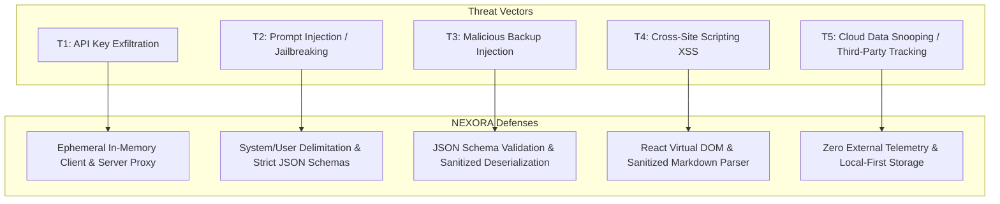

# NEXORA — Security Architecture & Threat Model

## 1. Security & Privacy Philosophy

NEXORA treats student privacy as a non-negotiable architectural invariant. Academic performance, personal schedule commitments, learning difficulties, and cognitive reflections are deeply private information. NEXORA enforces **Data Minimization, Zero Tracking, and Client-Side Sovereignty**.

---

## 2. Threat Model



---

## 3. Threat Analysis & Mitigations

### 3.1 T1: API Key Exfiltration & Exposure
* **Risk**: Exposure of student Gemini API keys or server credentials through source code commits, browser devtools inspection, or client bundles.
* **Mitigation**:
  - API keys are **strictly forbidden** from client-side bundles (`VITE_` prefix is prohibited for sensitive tokens).
  - The server reads the platform-managed `GEMINI_API_KEY` from `process.env`.
  - If a student provides their own key via Settings, it resides in the browser's origin-isolated `localStorage` and is transmitted directly to the local server proxy over loopback HTTP/HTTPS.
  - The server creates ephemeral, garbage-collected `GoogleGenAI` instances per request. Keys are never logged to console or persisted to disk.

---

### 3.2 T2: Prompt Injection & Adversarial Syllabus Ingestion
* **Risk**: Malicious course titles or crafted syllabus text attempting to hijack the AI Advisory Engine into outputting arbitrary instructions.
* **Mitigation**:
  - Clear system prompt boundary demarcation.
  - Enforced `application/json` MIME type output constraint. The Gemini API rejects attempts to return unstructured executable script text.
  - Client and server parse model outputs through strict TypeScript interfaces; unparsed or malformed responses trigger deterministic fallbacks immediately.

---

### 3.3 T3: Malicious Backup Injection & Prototype Pollution
* **Risk**: A corrupted or tampered `.json` backup file containing malicious scripts or prototype pollution vectors.
* **Mitigation**:
  - `importStateFromJSON()` executes defensive validation:
    ```typescript
    const parsed = JSON.parse(jsonString);
    if (!parsed.profile || !parsed.subjects) {
      throw new Error('Invalid NEXORA backup file format');
    }
    ```
  - State is merged explicitly against the known `INITIAL_DEMO_STATE` schema rather than executing shallow object assignments.

---

### 3.4 T4: Cross-Site Scripting (XSS)
* **Risk**: User notes or AI tutor markdown executing arbitrary JavaScript within the application context.
* **Mitigation**:
  - Standard UI text is rendered through React JSX, which automatically escapes untrusted strings.
  - Rich markdown content in the AI Tutor is rendered via `react-markdown` without `dangerouslySetInnerHTML`, stripping raw `<script>` tags and arbitrary inline HTML.

---

### 3.5 T5: Third-Party Telemetry & Data Harvesting
* **Risk**: Academic records or personal reflections leaking to third-party ad networks or tracking scripts.
* **Mitigation**:
  - Zero external tracking scripts, Google Analytics tags, Facebook pixels, or session recorders.
  - Zero third-party web font or CDN dependencies (Tailwind is bundled locally; icons are bundled from `lucide-react`).

---

## 4. Security Checklist for Deployments

- [x] Ensure `.env` is listed in `.gitignore` and never committed to version control.
- [x] Bind server to port `3000` and host `0.0.0.0`.
- [x] Verify that `metadata.json` requests only required frame permissions.
- [x] Verify that all API endpoints enforce rate-limiting or payload size bounds in production reverse proxies.
