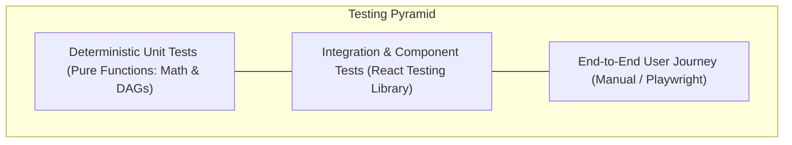

# NEXORA — Testing & Verification Strategy

## 1. Testing Philosophy

Because NEXORA relies on a **deterministic mathematical core**, testing focuses heavily on verifying invariant constraints (time arithmetic, capacity limits, graph traversal) alongside user interaction flows (focus timers, AI diff review, state persistence).



---

## 2. Unit Testing Specifications (`scheduler.ts`)

### 2.1 Daily Capacity Math (`calculateDailyCapacity`)
| Test Case ID | Scenario Description | Expected Output |
| :--- | :--- | :--- |
| **TC-CAP-01** | Standard weekday with 2 lectures (180 min total) + 8h sleep + 15m transition buffer. | Raw uncommitted = $1440 - 480 - 120 - 180 - 30 = 630\text{ min}$.<br/>Sustainable 75% = $472\text{ min}$.<br/>Capped at user ceiling (270 min) $\to 270\text{ min}$. |
| **TC-CAP-02** | Heavy lab day with 8 hours of fixed commitments. | Raw uncommitted is small; output is bounded by minimum floor of $30\text{ min}$. |
| **TC-CAP-03** | Date falling within configured semester reading week. | Free time override active; available study time derived from at least $360\text{ min}$ baseline. |
| **TC-CAP-04** | Weekend date with zero fixed timetable slots. | Raw uncommitted = $1440 - 480 - 120 = 840\text{ min}$. Capped by user ceiling. |

---

### 2.2 Time String Conversions (`timeToMinutes`, `minutesToTime`)
| Test Case ID | Input | Expected Output |
| :--- | :--- | :--- |
| **TC-TIME-01** | `"09:30"` | `570` minutes |
| **TC-TIME-02** | `"00:00"` (Midnight) | `0` minutes |
| **TC-TIME-03** | `"23:59"` | `1439` minutes |
| **TC-TIME-04** | Invalid string `""` or `"invalid"` | `0` (Graceful fallback) |
| **TC-TIME-05** | `minutesToTime(570)` | `"09:30"` |
| **TC-TIME-06** | `minutesToTime(1500)` (Overflow) | Clamped to `"23:59"` |

---

### 2.3 Prerequisite DAG Evaluation (`evaluatePrerequisites`)
| Test Case ID | Graph Scenario | Expected Output |
| :--- | :--- | :--- |
| **TC-DAG-01** | Topic with no prerequisites (`prerequisiteTopicIds: []`). | `{ prerequisitesMet: true, missingPrereqs: [] }` |
| **TC-DAG-02** | Topic whose prerequisite has status `'completed'` (Mastery $\ge 80\%$). | `{ prerequisitesMet: true, missingPrereqs: [] }` |
| **TC-DAG-03** | Topic whose prerequisite has status `'in_progress'` (Mastery 45%). | `{ prerequisitesMet: false, missingPrereqs: [PrereqTopic] }` |
| **TC-DAG-04** | Multi-parent DAG node where 1 of 3 prerequisites is unfulfilled. | `{ prerequisitesMet: false, missingPrereqs: [MissingTopic] }` |

---

## 3. Storage & Serialization Verification (`storage.ts`)

### 3.1 State Export & Restoration
- **TC-STORE-01**: Serializing `AppState` through `exportStateAsJSON()` produces valid UTF-8 JSON containing all required root entities (`profile`, `semesters`, `subjects`, `timetable`, `topics`, `missions`, `sessions`).
- **TC-STORE-02**: Ingesting a corrupted or malformed JSON payload into `importStateFromJSON()` throws an explicit schema error without corrupting active `localStorage`.
- **TC-STORE-03**: Resetting state via `resetToDemoState()` restores canonical default semester data.

---

## 4. Component & Integration Workflows

### 4.1 Daily Planner AI Diff Staging
1. Load Planner view for target date.
2. Trigger AI proposal request.
3. Verify that the AI diff card renders proposed tasks with priority scores, estimated minutes, and individual selection checkboxes.
4. Uncheck one item, click *Commit to Today's Mission*.
5. Verify that only the checked items appear in `DailyMission.items`.

### 4.2 Focus Session Tracker & Mastery Boost
1. Launch session modal targeting topic with mastery = 40%.
2. Run focus timer for test duration.
3. Log completion with `comprehensionRating = 4` (Boost = $+20\%$).
4. Verify that topic mastery updates to 60%.
5. Verify that a new entry is recorded in `state.sessions`.

---

## 5. Build & Quality Verification Commands

```bash
# Type check and lint codebase
npm run lint

# Compile frontend bundle and server CommonJS bundle
npm run build

# Start production server
npm run start
```
